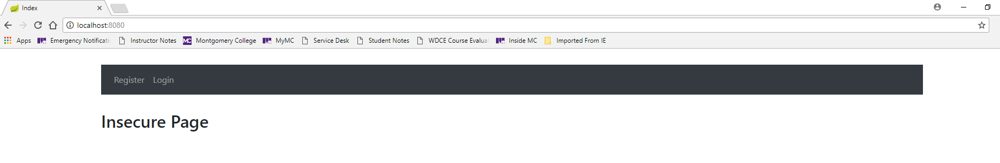
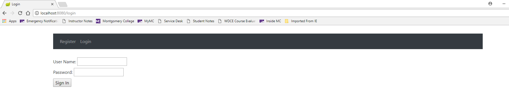
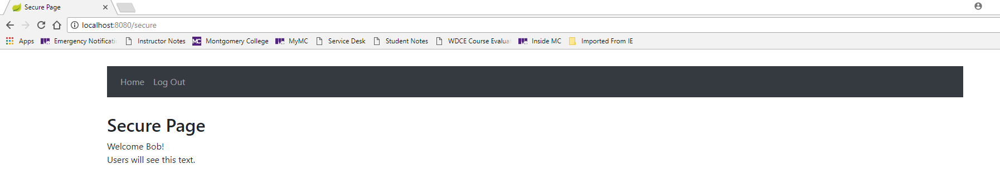
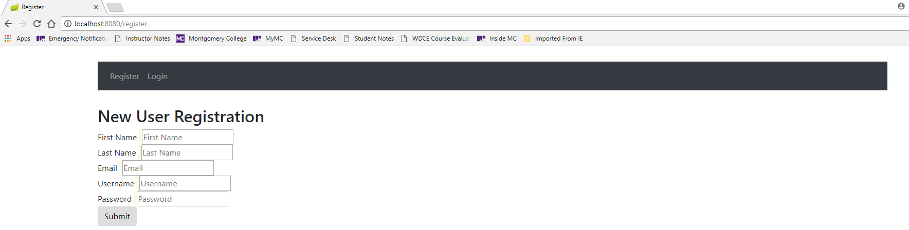

# Spring Boot Security
## Learning Objectives
* Setting up Spring Boot Security
* Creating a custom login screen
* Implementing role-based permissions
* Designating users with specific roles
* Implementing a registration page
* Implementing database-based authentication
* Working with a Service class
* Implementing a function to autoload data on application start
* Implementing a Command Line Runner class

## The Walkthrough

1. **Create a Spring Boot Application**
	* Name it SpringBootSecurity
	* Add the dependencies for security, web and thymeleaf
	* Hit next until you finish the wizard, and then wait until it's done.


2. **Setup H2**
	* Add the dependencies by:
	* Open the pom.xml file
    	* Add the following xml right before the line that reads:  &lt;/dependencies>
```xml
		<dependency>
			<groupId>org.springframework.boot</groupId>
			<artifactId>spring-boot-starter-data-jpa</artifactId>
		</dependency>
		<dependency>
			<groupId>org.springframework.boot</groupId>
			<artifactId>spring-boot-devtools</artifactId>
			<scope>runtime</scope>
		</dependency>
		<dependency>
			<groupId>com.h2database</groupId>
			<artifactId>h2</artifactId>
			<scope>runtime</scope>
		</dependency>
		<dependency>
			<groupId>org.thymeleaf.extras</groupId>
			<artifactId>thymeleaf-extras-springsecurity4</artifactId>
		</dependency>
```


Edit the application.properties file to look like this:
```
spring.datasource.url=jdbc:h2:mem:testdb
spring.h2.console.enabled=true
spring.h2.console.path=/h2-console
spring.jpa.hibernate.ddl-auto=create
```

3. **Import your maven dependencies:**
    * Either click the Import Changes link in the lower right hand corner, or
    * Right-click your project and click Maven -> Re-Import
    * Wait for the background tasks to complete


4. **Create the User Class**
    * Right click on com.example.demo and click New -> Class
    * Name it User.java
    * Edit it to look like this:
```java
@Entity
@Table(name="USER_DATA")
public class User {
    @Id
    @GeneratedValue(strategy = GenerationType.AUTO)
    private long id;

    @Column(name = "email", nullable = false)
    private String email;

    @Column(name = "password")
    private String password;

    @Column(name = "first_name")
    private String firstName;

    @Column(name = "last_name")
    private String lastName;

    @Column(name = "enabled")
    private boolean enabled;

    @Column(name = "username")
    private String username;

    @ManyToMany(fetch = FetchType.EAGER)
    @JoinTable(joinColumns = @JoinColumn(name = "user_id"),
    inverseJoinColumns = @JoinColumn(name = "role_id"))
    private Collection<Role> roles;
}
```

5. **Autogenerate getters and setters**
    * Right click on the word User
    * Click Generate -> Getters and Setters


6. **Add loaded constructor to User**
    * Right-click and Select Generate -> Constructor
    * Click on email, password, firstName, lastName, enabled, username
    * Click OK


7. **Add default constructor to User**
    * Right-click and Select Generate -> Constructor
    * Click on the "Select None" button
    * Click OK

8. **Create a User Repository**
    * Right click on com.example.demo and click New -> Class
    * Name it UserRepository.java
    * Edit it to look like this:

	```java
	import org.springframework.data.repository.CrudRepository;

	public interface UserRepository extends CrudRepository<User, Long>{
	    User findByUsername(String username);
	}
	```

9. **Create the Role Class**
    * Right click on com.example.demo and click New -> Class
    * Name it Role.java
    * Edit it to look like this:
```java
@Entity
public class Role {

    @Id
    @GeneratedValue(strategy = GenerationType.AUTO)
    private long id;

    @Column(unique=true)
    private String role;

    @ManyToMany(mappedBy = "roles",fetch = FetchType.LAZY)
    private Collection<User> users;
}
```

10. **Autogenerate getters and setters**
    * Right click on the word Role
    * Click Generate -> Getters and Setters


11. **Add loaded constructor to Role**
    * Right-click and Select Generate -> Constructor
    * Click on role
    * Click OK


12. **Add default constructor to Role**
    * Right-click and Select Generate -> Constructor
    * Click on the "Select None" button
    * Click OK

13. **Create a Role Repository**
    * Right click on com.example.demo and click New -> Class
    * Name it RoleRepository.java
    * Edit it to look like this:
```java
	import org.springframework.data.repository.CrudRepository;

	public interface RoleRepository extends CrudRepository<Role, Long>{
		Role findByRole(String role);
	}
```

14. **Create a SecurityConfiguration Class**
	* Right click on com.example.demo and click New -> Class
	* Name it SecurityConfiguration.java
	* Edit it to look like this (comments are optional):

		```java
		import org.springframework.beans.factory.annotation.Autowired;
		import org.springframework.context.annotation.Bean;
		import org.springframework.context.annotation.Configuration;
		import org.springframework.security.config.annotation.authentication
			.builders.AuthenticationManagerBuilder;
		import org.springframework.security.config.annotation.web
			.builders.HttpSecurity;
		import org.springframework.security.config.annotation.web
			.configuration.EnableWebSecurity;
		import org.springframework.security.config.annotation.web.configuration
			.WebSecurityConfigurerAdapter;
		import org.springframework.security.core.userdetails.UserDetailsService;
		import org.springframework.security.crypto.bcrypt.BCryptPasswordEncoder;
		import org.springframework.security.crypto.password.PasswordEncoder;
		import org.springframework.security.web.util.matcher.AntPathRequestMatcher;

		// This is a file that sets up the applicaition to restrict access. By
		// default, if access is not specified, it is denied. You have to
		// specifically permit access to each page, directory or group of pages in
		// your application. The class you create (SecurityConfiguration) extends
		// the WebSecurityConfigurerAdapter, which has all of the methods needed to
		// include security in your application.

		// @Configuration and @EnableWebSecurity
		// These annotations indicates to the compiler that the file is a
		// configuration file and Spring Security is enabled for the application.
		@Configuration
		@EnableWebSecurity
		public class SecurityConfiguration extends WebSecurityConfigurerAdapter {

				@Bean
				public PasswordEncoder encoder() {
						return new BCryptPasswordEncoder();
				}

				@Autowired
				private UserRepository userRepository;

				@Override
				public UserDetailsService userDetailsServiceBean() throws Exception {
						return new SSUserDetailsService(userRepository);
				}

				// configure()
				// This overrides the default configure method, configures users who can
				// access the application. By default, Spring Boot will provide a new
				// random password assigned to the user "user" when it starts up, if you
				// do not include this method.
				//
				//
				// This is also the method in which you can configure how users are
				// granted access to the application if their details are stored in a
				// database.
				@Override
				protected void configure(HttpSecurity http) throws Exception{
						http
						.authorizeRequests()
						.antMatchers("/css/**","/", "/h2/**", "/register").permitAll()
						.anyRequest().authenticated()
						.and()
						.formLogin().loginPage("/login").permitAll() // Must be on it's own line
						.and()
						// logout() removes the user from the current session
						// default timeout is 20 minutes
						.logout()
						.logoutRequestMatcher(
						        new AntPathRequestMatcher("/logout"))
						// The user is redirected to the login page after logout
						.logoutSuccessUrl("/login").permitAll().permitAll()
						.and()
						.httpBasic();
						http
						.csrf().disable(); // Only for the H2 console, NOT IN PRODUCTION
						http
						.headers().frameOptions().disable(); // Only for the H2 console, NOT IN PRODUCTION
	    }

	    @Override
	    protected void configure(AuthenticationManagerBuilder auth)
	            throws Exception {

	        // Manually creates Spring Security user
	        /*
	        auth.inMemoryAuthentication().withUser("dave")
	                .password(encoder().encode("password")).authorities("ADMIN");
	        */

	        // Allows database authentication
	        auth.userDetailsService(userDetailsServiceBean())
	                .passwordEncoder(encoder());
	    }
		}
		```

### antMatcher

Allows configuring the HttpSecurity to only be invoked when matching the
provided ant pattern.

#### Ant Pattern Matcher

PathMatcher implementation for Ant-style path patterns. Part of this mapping
code has been kindly borrowed from Apache Ant.

```
The mapping matches URLs using the following rules:
? matches one character
* matches zero or more characters
** matches zero or more directories in a path
{spring:[a-z]+} matches the regexp [a-z]+ as a path variable named "spring"
```

### authorizeRequests

This tells your application which requests should be authorized. In this
example, you are telling the application that any request that is authenticated
should be permitted. Right now, this means that if a user enters a correct
user/password combination, he/she will be directed to the default route.

The most basic example is to configure all URLs to require the role "ROLE_USER".
The configuration below requires authentication to every URL and will grant
access to both the user "admin" and "user".

```
@Override
        protected void configure(HttpSecurity http) throws Exception {
				http.authorizeRequests()
					.antMatchers("/admin/**")
					.hasRole("ADMIN")
					.antMatchers("/**")
					.hasRole("USER")
					.and().formLogin();
        }
```

Note that the matchers are considered in order. Therefore, the following is
invalid because the first matcher matches every request and will never get to
the second mapping:

```
 http.authorizeRequests()
 	.antMatchers("/**").hasRole("USER")
 	.antMatchers("/admin/**").hasRole("ADMIN")
 ```

### Login Form

**.formLogin().loginPage("/login").permitAll()**

This means that you are expecting a login form, which will display when you
visit the route /login, and everyone can see it, even if they are not
authenticated. This is therefore the page that people will see if they have not logged in yet,
before they are directed to the page that they can see after logging in.

 ### httpBasic

 Configures HTTP Basic authentication. HTTP Basic authentication (BA)
 implementation is the simplest technique for enforcing access controls to web
 resources because it does not require cookies, session identifiers, or login
 pages; rather, HTTP Basic authentication uses standard fields in the HTTP
 header, removing the need for handshakes.

 ```
 http.authorizeRequests()
 	.antMatchers("/**").hasRole("USER")
	.and().httpBasic();
 ```

 ### formLogin

Specifies to support form based authentication. If loginPage(String) is not
specified, Spring's default login page will be generated. The default login
form will also include messages for incorrect attempts.


15. **Create the SSUserDetailsService**
    * Right click on com.example.demo and click New -> Class
    * Name it SSUserDetailsService.java
    * Edit it to look like this:

		```java
		import org.springframework.security.core.GrantedAuthority;
		import org.springframework.security.core.authority.SimpleGrantedAuthority;
		import org.springframework.security.core.userdetails.UserDetails;
		import org.springframework.security.core.userdetails.UserDetailsService;
		import org.springframework.security.core.userdetails
				.UsernameNotFoundException;
		import org.springframework.stereotype.Service;
		import javax.transaction.Transactional;
		import java.util.HashSet;
		import java.util.Set;

		@Transactional
		@Service
		public class SSUserDetailsService implements UserDetailsService {

		    private UserRepository userRepository;

		    public SSUserDetailsService(UserRepository userRepository) {
		        this.userRepository = userRepository;
		    }

		    @Override
		    public UserDetails loadUserByUsername(String username)
								throws UsernameNotFoundException {
		        try {
		            User user = userRepository.findByUsername(username);
		            if(user == null) {
		                return null;
		            }

		            return new org.springframework.security.core.userdetails.User(
		                    user.getUsername(),
		                    user.getPassword(),
		                    getAuthorities(user));
		        }
		        catch (Exception e) {
		            throw new UsernameNotFoundException("User not found");
		        }
		    }

		    private Set<GrantedAuthority> getAuthorities(User user) {
		        Set<GrantedAuthority> authorities = new HashSet<>();
		        for(Role role : user.getRoles()) {
		            GrantedAuthority grantedAuthority =
											new SimpleGrantedAuthority(role.getRole());
		            authorities.add(grantedAuthority);
		        }
		        return authorities;
		    }
		}
		```

16. **Add a UserService Class**
    * Right-click on com.example.demo and click New -> Class
    * Name it UserService.java
    * Edit the contents to look like this:

	```java
	import org.springframework.beans.factory.annotation.Autowired;
	import org.springframework.security.core.Authentication;
	import org.springframework.security.core.context.SecurityContextHolder;
	import org.springframework.security.crypto.password.PasswordEncoder;
	import org.springframework.stereotype.Service;
	import java.util.Arrays;

	@Service
	public class UserService {
	    @Autowired
	    UserRepository userRepository;

	    @Autowired
	    RoleRepository roleRepository;

	    @Autowired
	    private PasswordEncoder passwordEncoder;

	    @Autowired
	    public UserService(UserRepository userRepository) {
	        this.userRepository = userRepository;
	    }

	    // Returns the currently logged in User object
	    public User getCurrentUser(){
	        Authentication authentication = SecurityContextHolder.getContext().getAuthentication();
	        String currentusername = authentication.getName();
	        User user = userRepository.findByUsername(currentusername);
	        return user;
	    }

	    public void saveUser(User user) {
	        user.setRoles(Arrays.asList(roleRepository.findByRole("USER")));
	        user.setEnabled(true);
	        user.setPassword(passwordEncoder.encode(user.getPassword()));
	        userRepository.save(user);
	    }

	    public void saveAdmin(User user) {
	        user.setRoles(Arrays.asList(roleRepository.findByRole("ADMIN")));
	        user.setEnabled(true);
	        user.setPassword(passwordEncoder.encode(user.getPassword()));
	        userRepository.save(user);
	    }
	}
	```

17. **Add a DataLoader Class**
    * Right-click on  and click New -> Class
    * Name it DataLoader.java
    * Edit the contents to look like this:

	```java
	import org.springframework.beans.factory.annotation.Autowired;
	import org.springframework.boot.CommandLineRunner;
	import org.springframework.security.crypto.password.PasswordEncoder;
	import org.springframework.stereotype.Component;
	import java.util.Arrays;

	// The DataLoader() class will add user/role data into the database before
	// the application runs
	@Component
	public class DataLoader implements CommandLineRunner{
	    // Instantiate both the user and role repository to invoke constructor methods
	    @Autowired
	    UserRepository userRepository;

	    @Autowired
	    RoleRepository roleRepository;

	    @Autowired
	    private PasswordEncoder passwordEncoder;

	    /*
	        Run method will be executed after the application context is
	        loaded and right before the Spring Application run method is
	        completed.
	     */
	    @Override
	    public void run(String... strings) throws Exception{
	        System.out.println("Loading data...");

	        roleRepository.save(new Role("USER"));
	        roleRepository.save(new Role("ADMIN"));

	        Role userRole = roleRepository.findByRole("USER");
	        Role adminRole = roleRepository.findByRole("ADMIN");

	        User user = new User("bob@bob.com",passwordEncoder.encode("password"),"Bob","Bobberson",true,"bob");
	        user.setRoles(Arrays.asList(userRole));
	        userRepository.save(user);

	        user = new User("admin@adm.com",passwordEncoder.encode("password"),"Admin","User",true,"admin");
	        user.setRoles(Arrays.asList(adminRole));
	        userRepository.save(user);
	    }
	}
		```

18. **Create the Controller**
    * Name it HomeController.java
    * Edit it to look like this:

	```java
	import org.springframework.beans.factory.annotation.Autowired;
	import org.springframework.stereotype.Controller;
	import org.springframework.ui.Model;
	import org.springframework.validation.BindingResult;
	import org.springframework.web.bind.annotation.*;
	import javax.validation.Valid;

	@Controller
	public class HomeController {
	    @Autowired
	    private UserService userService;

	    @GetMapping("/register")
	    public String showRegistrationPage(Model model) {
	        model.addAttribute("user", new User());
	        return "/registration";
	    }

	    @PostMapping("/register")
	    public String processRegistrationPage(@Valid @ModelAttribute("user") User user,
								BindingResult result, Model model) {
	        model.addAttribute("user",user);
	        if(result.hasErrors()) {
	            return "registration";
	        }
	        else {
	            userService.saveUser(user);
	            model.addAttribute("message", "User Account Successfully Created");
	        }
	        return "index";
	    }

	    @RequestMapping("/")
	    public String index() {
	        return "index";
	    }

	    @RequestMapping("/login")
	    public String login() {
	        return "login";
	    }

	    @RequestMapping("/secure")
	    public String secure(Model model) {
	        model.addAttribute("user", userService.getCurrentUser());
	        return "secure";
	    }
	}
	````

19. **Create the base Template**
	  * Name it base.html
	  * Edit it to look like this:

	```Html
	<!DOCTYPE html>
	<html lang="en" xmlns:th="www.thymeleaf.org" xmlns:sec="www.thymeleaf.org/extras/spring-security">
	<head th:fragment="header">
	    <meta charset="UTF-8" />
	    <link rel="stylesheet" th:href="@{/css/bootstrap.min.css}" type="text/css" />
	    <link rel="stylesheet" th:href="@{/css/style.css}" type="text/css" /> <!--custom stylesheet-->
	</head>
	<body>

	    <div th:fragment="navlinks" >
	        <nav class="navbar navbar-expand-sm bg-dark navbar-dark">
	            <ul class="navbar-nav">
	                    <li class="nav-item" sec:authorize="isAuthenticated()">
	                        <a class="nav-link" href="/">Home</a>
	                    </li>
	                    <li class="nav-item" sec:authorize="isAnonymous()">
	                        <a class="nav-link" href="/register">Register</a>
	                    </li>
	                    <li class="nav-item" sec:authorize="isAnonymous()">
	                        <a class="nav-link" href="/secure">Login</a>
	                    </li>
	                    <li class="nav-item" sec:authorize="isAuthenticated()">
	                        <a class="nav-link" href="/logout">Log Out</a>
	                    </li>
	                </ul>
	        </nav>
	    </div>

	</body>
	</html>
	```

20. **Create the Login Template**
	  * Name it login.html
	  * Edit it to look like this:

	```html
	<!DOCTYPE html>
	<html lang="en" xmlns:th="http://www.thymeleaf.org" xmlns:sec="www.thymeleaf.org/extras/spring-security">
	<head>
	    <title>Login</title>
	    <th:block th:insert="base :: header"></th:block>
	</head>
	<body>

	    <div th:replace="base :: navlinks"></div>

	    <div th:if="${param.error}">
	        Invalid username and password.
	    </div>
	    <div th:if="${param.logout}">
	        You have been logged out.
	    </div>
	    <form th:action="@{/login}" method="post">
	        <div>
	            <label>User Name: <input type="text" name="username"/></label>
	        </div>
	        <div>
	            <label>Password: <input type="password" name="password"/></label>
	        </div>
	        <div><input type="submit" value="Sign In"/></div>
	    </form>

	</body>
	</html>
	```

21. **Create the Index Template**
  	* Right click on templates and click New -> Html
  	* Name it index.html
  	* Edit it to look like this:

	```html
	<!DOCTYPE html>
	<html lang="en" xmlns:th="http://www.thymeleaf.org" xmlns:sec="www.thymeleaf.org/extras/spring-security">
	<head>
	    <title>Index</title>
	    <th:block th:insert="base :: header"></th:block>
	</head>
	<body>

	    <div th:replace="base :: navlinks"></div>

	    <h2>Insecure Page</h2>

	</body>
	</html>
	```

22. **Create a Secure Template**
  	* Right click on templates and click New -> Html
	  * Name it secure.html
	  * Edit it to look like this:

	```html
	<!DOCTYPE html>
	<html lang="en" xmlns:th="http://www.thymeleaf.org" xmlns:sec="www.thymeleaf.org/extras/spring-security">
	<head>
	    <title>Secure Page</title>
	    <th:block th:insert="base :: header"></th:block>
	</head>
	<body>

	    <div th:replace="base :: navlinks"></div>

	    <h2>Secure Page</h2>

	    <div>Welcome [[${user.firstName}]]!</div>

	    <div sec:authorize="hasAuthority('ADMIN')">
	        Administrators will see this text.
	    </div>

	    <div sec:authorize="hasAuthority('USER')">
	        Users will see this text.
	    </div>

	</body>
	</html>
	```

23. **Create a Register Template**
  	* Right click on templates and click New -> Html
	  * Name it registration.html
	  * Edit it to look like this:

	```Html
	<!DOCTYPE html>
	<html lang="en" xmlns:th="http://www.thymeleaf.org" xmlns:sec="www.thymeleaf.org/extras/spring-security">
	<head>
	    <title>Register</title>
	    <th:block th:insert="base :: header"></th:block>
	</head>
	<body>

	    <div th:replace="base :: navlinks"></div>

	    <h2>New User Registration</h2>

	    <form autocomplete="off" action="#" th:action="@{/register}" th:object="${user}" method="post">
	        First Name
	        <mark>
	            <strong>
	                <span th:if="${#fields.hasErrors('firstName')}" th:errors="*{firstName}">First Name Error</span>
	            </strong>
	        </mark>
	        <input type="text" id="firstName" placeholder="First Name" th:field="*{firstName}"/><br/>
	        Last Name
	        <mark>
	            <strong>
	                <span th:if="${#fields.hasErrors('lastName')}" th:errors="*{lastName}">Last Name Error</span>
	            </strong>
	        </mark>
	        <input type="text" id="lastName" placeholder="Last Name" th:field="*{lastName}"/><br/>
	        Email
	        <mark>
	            <strong>
	                <span th:if="${#fields.hasErrors('email')}" th:errors="*{email}">Email Error</span>
	            </strong>
	        </mark>
	        <input type="text" id="email" placeholder="Email" th:field="*{email}"/><br/>
	        Username
	        <mark>
	            <strong>
	                <span th:if="${#fields.hasErrors('username')}" th:errors="*{username}">Username Error</span>
	            </strong>
	        </mark>
	        <input type="text" id="username" placeholder="Username" th:field="*{username}"/><br/>
	        Password
	        <mark>
	            <strong>
	                <span th:if="${#fields.hasErrors('password')}" th:errors="*{password}">Password Error</span>
	            </strong>
	        </mark>
	        <input type="text" id="password" placeholder="Password" th:field="*{password}"/><br/>
	        <button type="submit" class="btn btn-default">Submit</button>
	    </form>

	</body>
	</html>
	```
24. **Add Bootstrap stylesheet**
  	* Right click on templates and click New -> Directory
	  * Name it static
	  * Under the new "static" folder, create a new folder "css"
	  * Go to https://maxcdn.bootstrapcdn.com/bootstrap/4.0.0/css/bootstrap.min.css and save the CSS text as "boostrap.min.css" under the CSS folder

25. **Add custom stylesheet**
  	* Right click on the css folder and right-click --> New --> Stylesheet
	  * Name it style.css
	  * Edit it to look like this:

		```css
		body {
			margin: 30px auto;
			width: 80%;
		}

		.navbar {
			margin-bottom: 30px;
		}
		```


26. **Run your application and open a browser, and you should see this:**


If you click on the Login link, you should see this:


You should be able to login with the account bob and password password.

After you log in, you should see the secure page:


If you log out and go to the "Register" link, you should see this:


Try creating a new user and then logging in with that user.

## Congratulations!

You're ready to add basic security to your Spring Boot web application. This will help to ensure that people are who they say they are (because they use the appropriate passwords to sign in), and that they can access information within your application because they are authorized to have access to it, since they are assigned authorities.
